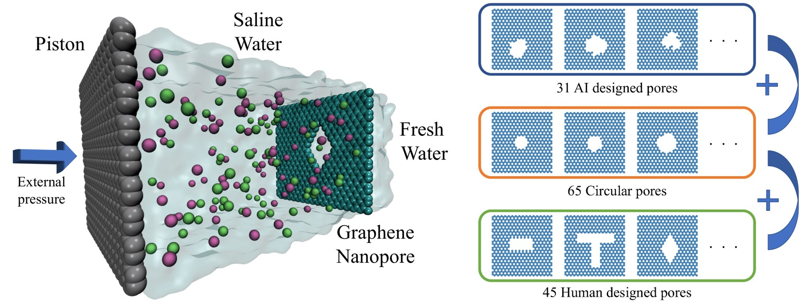

# Molecular Dynamics Simulation Trajectories of Water Desalination Systems Using 141 Nanoporous Graphene

Zhonglin Cao*, Yuyang Wang*, Amir Barati Farimani <br/>
(* equal contribution)

Carnegie Mellon University, Pittsburgh, PA 15213, USA



This is the Github repository for the paper *"Molecular Dynamics Simulation Trajectories of Water Desalination Systems Using 141 Nanoporous Graphene"* submitted to [*Scientific Data*](https://www.nature.com/sdata/). This repo introduces how to use and analyze the dataset. 

The whole dataset consists of three sections: 

1. topology (in the format of `.pdb` file) of each nanoporous graphene membrane simulated; 
2. snapshot (in the format of `.png` file) of each graphene membrane for the convenience of visually selecting trajectory files to analyze;
3. processed trajectories (in the format of `.npz` file) of MD simulations using different graphene membranes. 

Therefore for a specific nanoporous graphene membrane named as `membrane_${ID}`, its complete data include three files: `membrane_${ID}.pdb`, `membrane_${ID}.png` and `membrane_${ID}.npz`.

## Prerequisites
---
- Windows, Linux or macOS
- Python 3

## Getting Started
---
### Installation
```
$ git clone https://github.com/zcao0420/MD-Trajectories-of-Graphene-Water-Desalination.git
$ cd MD-Trajectories-of-Graphene-Water-Desalination
$ conda env create --name graphene --file env.yml
$ conda activate graphene
```
You can also refer to [``requirements.txt``](https://github.com/zcao0420/MD-Trajectories-of-Graphene-Water-Desalination/blob/master/requirements.txt) for installing the dependencies in your own environment. 

### Download the dataset

```
```

### Usage and analysis

Please refer to [``How_to_use_dataset.ipynb``](https://github.com/zcao0420/MD-Trajectories-of-Graphene-Water-Desalination/blob/master/How_to_use_dataset.ipynb) for detailed instruction of how to analyse the dataset.  

